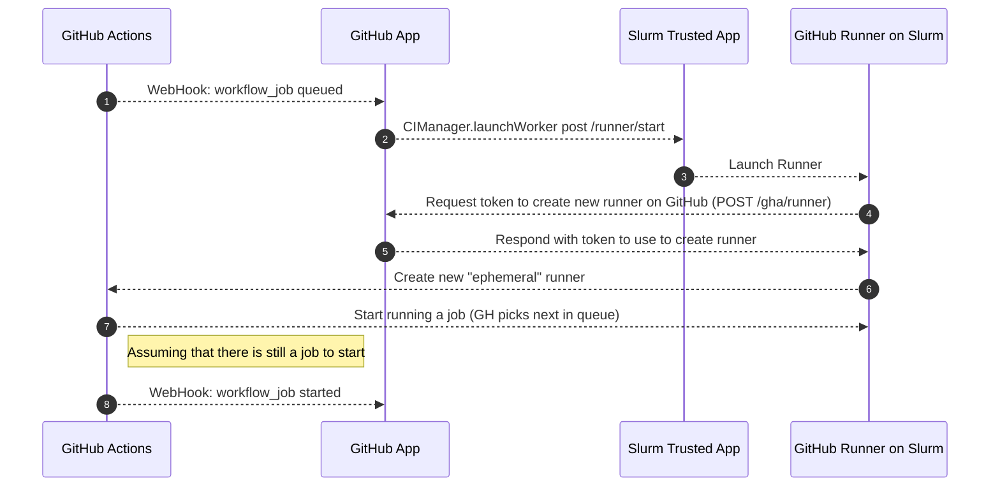

# gha-slurm

## Workflow for starting a runner

```mermaid
sequenceDiagram
    autonumber
    participant GHA as GitHub Actions 
    participant GHApp as GitHub App
    participant Slurm as Slurm Trusted App
    participant Runner as GitHub Runner on Slurm

    GHA-->>GHApp: WebHook: workflow_job queued
    GHApp-->>Slurm: CIManager.launchWorker post /runner/start 
    Slurm-->>Runner: Launch Runner
    Runner-->>GHApp: Request token to create new runner on GitHub (POST /gha/runner)
    GHApp-->>Runner: Respond with token to use to create runner
    Runner-->>GHA: Create new "ephemeral" runner
    GHA-->>Runner: Start running a job (GH picks next in queue)
    Note right of GHA: Assuming that there is still a job to start
    GHA-->>GHApp: WebHook: workflow_job started
```