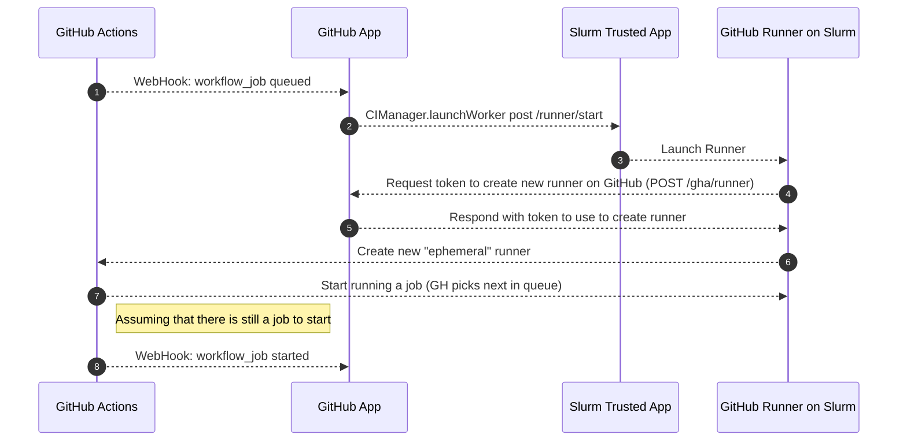

# GitHub Application for Managing CI Infrastructure

This is a simple GitHub Application for managing build requests. It works in concert with [ripley-cloud/gha-slurm-munge](https://github.com/ripley-cloud/gha-slurm-munge) to automatically launch GitHub Actions Runners as Slurm jobs. 

This app is trusted by GitHub (must be installed as a GitHub App), and can act on behalf of users who trigger builds on GitHub Actions. [ripley-cloud/gha-slurm-munge](https://github.com/ripley-cloud/gha-slurm-munge) are the components that need to be trusted by Slurm (e.g. run in your munge domain, as the SlurmUser).

The high level workflow to launch a build runner is:
1. Receive webhook from GitHub that a build is needed, check the labels on the requested runner
2. Generate a self-signed JWT token that encodes the build request, send this to [ripley-cloud/gha-slurm-munge](https://github.com/ripley-cloud/gha-slurm-munge) to request that an actions runner be scheduled to run in Slurm
3. Once the Slurm Job is allocated, the node sends the JWT token back to this app, which checks it, and then if valid, refreshes the GitHub runner token (the slurm job might wait in the scheduler for so long that the token expired, which is why there is this intermediate step).
4. Actions runner starts and connects to GitHub. If there is no build started within 2 minutes (e.g. if the request was satisfied by another runner outside of our control, or canceled by the user), the job terminates and releases its resources

### Workflow for starting a runner

